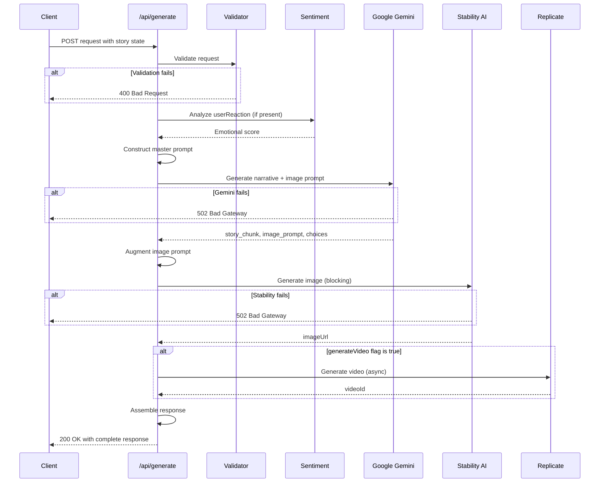
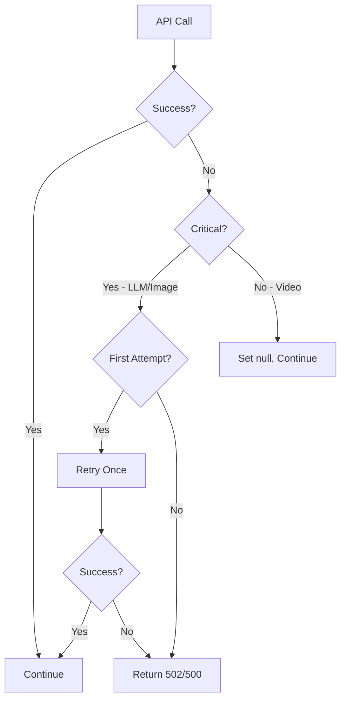

# Design Document

## Overview

The Hauntographer Backend is implemented as a Next.js API route that orchestrates multiple AI services to generate interactive horror narratives. The system follows a stateless architecture where all context is provided by the client in each request. The backend acts as an orchestrator, coordinating between Google Gemini for narrative generation, Stability AI for image generation, Replicate for optional video generation, and the sentiment npm package for emotional analysis.

### Key Design Principles

1. **Stateless Architecture**: No server-side session management; all state is maintained by the client
2. **Sequential Processing**: LLM generation → Image generation (blocking) → Video generation (async)
3. **Fail-Safe Operations**: Graceful degradation when optional features fail
4. **Type Safety**: Full TypeScript implementation with strict type definitions
5. **Environment-Based Configuration**: All API keys and configuration via environment variables

## Architecture

### High-Level Flow



### Technology Stack

- **Runtime**: Next.js 15.5.4 API Routes (App Router)
- **Language**: TypeScript 5.x
- **LLM**: Google Gemini API (via @google/generative-ai SDK)
- **Image Generation**: Stability AI API
- **Video Generation**: Replicate API
- **Sentiment Analysis**: sentiment npm package
- **HTTP Client**: Native fetch API

## Components and Interfaces

### 1. Type Definitions

```typescript
// Request Types
interface StoryProfile {
  fears: string;
  genre: string;
}

interface HistoryEntry {
  role: 'user' | 'model';
  content: string;
}

interface RequestFlags {
  generateVideo?: boolean;
}

interface GenerateRequest {
  storyProfile?: StoryProfile;
  storyHistory: HistoryEntry[];
  userReaction?: string | null;
  flags?: RequestFlags;
}

// Response Types
interface Visuals {
  imageUrl: string;
  videoId: string | null;
}

interface GenerateResponse {
  nextStoryChunk: string;
  choices: [string, string];
  visuals: Visuals;
  updatedHistory: HistoryEntry[];
}

// LLM Response Type
interface LLMResponse {
  story_chunk: string;
  image_prompt: string;
  choices: [string, string];
}

// Error Response Type
interface ErrorResponse {
  error: string;
}
```

### 2. Validation Module

**Purpose**: Validate incoming requests and ensure data integrity

**Functions**:
- `validateRequest(body: unknown): { valid: boolean; error?: string; data?: GenerateRequest }`
  - Validates request structure
  - Checks for required fields based on story state
  - Returns typed data or error message

**Validation Logic**:
```typescript
// First turn validation
if (storyHistory.length === 0) {
  if (!storyProfile?.fears || !storyProfile?.genre) {
    return { valid: false, error: "Initial request requires fears and genre" };
  }
}

// Subsequent turn validation
if (storyHistory.length > 0) {
  if (!Array.isArray(storyHistory)) {
    return { valid: false, error: "storyHistory must be an array" };
  }
}
```

### 3. Sentiment Analysis Module

**Purpose**: Analyze user emotional reactions to adapt narrative

**Functions**:
- `analyzeSentiment(reaction: string): number`
  - Uses sentiment package to calculate comparative score
  - Returns score between -1 (negative) and 1 (positive)
  - Score of 0 indicates neutral

**Implementation**:
```typescript
import Sentiment from 'sentiment';

const sentiment = new Sentiment();

function analyzeSentiment(reaction: string): number {
  const result = sentiment.analyze(reaction);
  return result.comparative; // Normalized score
}
```

### 4. Prompt Construction Module

**Purpose**: Build dynamic prompts for the LLM with all contextual data

**Functions**:
- `buildMasterPrompt(profile: StoryProfile, history: HistoryEntry[], emotionalScore?: number): string`
  - Constructs the complete prompt with placeholders filled
  - Includes adaptive instructions based on sentiment
  - Formats history as readable context

**Prompt Structure**:
- System instructions defining the AI's role
- User profile (fears, genre)
- Complete story history
- Emotional score with interpretation
- Adaptive instructions based on sentiment
- JSON response format specification

### 5. LLM Service

**Purpose**: Interface with Google Gemini API

**Functions**:
- `generateNarrative(prompt: string): Promise<LLMResponse>`
  - Sends prompt to Gemini
  - Requests JSON response mode
  - Parses and validates response structure
  - Implements single retry on malformed response

**Configuration**:
- Model: `gemini-1.5-pro` or `gemini-1.5-flash` (configurable)
- Response format: JSON
- Temperature: 0.8 (for creative storytelling)
- Max tokens: 2048

**Error Handling**:
- Network errors → throw for 502 handling
- Malformed JSON → retry once, then throw for 500 handling
- Missing keys → throw for 500 handling

### 6. Image Generation Service

**Purpose**: Generate horror images via Stability AI

**Functions**:
- `augmentImagePrompt(basePrompt: string, genre: string): string`
  - Adds cinematic and stylistic keywords
  - Incorporates genre-specific styling
  
- `generateImage(prompt: string): Promise<string>`
  - Calls Stability AI API
  - Returns direct image URL
  - Blocking operation

**Prompt Augmentation**:
```typescript
const styleKeywords = [
  "cinematic horror",
  "ultra-realistic",
  "dramatic lighting",
  "high contrast",
  "atmospheric",
  `${genre} style`,
  "4k quality",
  "professional photography"
];

const augmentedPrompt = `${basePrompt}, ${styleKeywords.join(", ")}`;
```

**API Configuration**:
- Endpoint: Stability AI v1 or v2 (text-to-image)
- Engine: stable-diffusion-xl-1024-v1-0
- Steps: 30
- CFG Scale: 7

### 7. Video Generation Service

**Purpose**: Optionally generate video via Replicate

**Functions**:
- `generateVideoAsync(prompt: string): Promise<string | null>`
  - Initiates video generation
  - Returns prediction ID immediately
  - Non-blocking operation
  - Returns null on failure (graceful degradation)

**API Configuration**:
- Model: Replicate's video generation model
- Async execution: Does not await completion
- Returns: Prediction ID for client-side polling

### 8. Response Assembly Module

**Purpose**: Construct the final API response

**Functions**:
- `assembleResponse(llmResponse: LLMResponse, imageUrl: string, videoId: string | null, history: HistoryEntry[]): GenerateResponse`
  - Combines all generated content
  - Updates story history
  - Formats response according to contract

**History Update Logic**:
```typescript
const updatedHistory = [
  ...history,
  {
    role: 'model',
    content: llmResponse.story_chunk
  }
];
```

## Data Models

### Story State Model

The story state is entirely client-managed and passed in each request:

```typescript
{
  profile: {
    fears: string,      // User's specific fears
    genre: string       // Horror subgenre
  },
  history: [
    { role: 'user', content: 'choice text' },
    { role: 'model', content: 'story chunk' },
    // ... continues
  ],
  currentEmotion: number  // Derived from userReaction
}
```

### Master Prompt Template

The complete prompt template with all placeholders:

```
You are 'The Hauntographer', a master AI horror storyteller that generates interactive, personalized narratives. Your responses MUST be a single, valid JSON object and nothing else.

// --- User Profile ---
const userProfile = {
  fears: "{fears}",
  genre: "{genre}"
};

// --- Story Context ---
const storyHistory = {history_array_as_string};

// --- User's Last Reaction ---
// (A negative score indicates fear/discomfort, positive indicates amusement/boredom)
const emotionalScore = {sentiment_score};

// --- Your Instructions ---
/*
1.  **Analyze the context:** Review the user's profile and the entire story history.
2.  **Adapt to Emotion:** If the `emotionalScore` is negative or zero, maintain or escalate the current style of horror. If the score is positive, you MUST pivot your narrative strategy—introduce a different kind of scare, deepen the mystery, or build atmospheric dread instead of direct confrontation.
3.  **Write the Next Chapter:** Continue the story with 1-2 new paragraphs. The narrative MUST conform to the user's chosen `genre` and incorporate their `fears`.
4.  **Create Choices:** Conclude your story chunk with exactly two distinct, compelling choices for the user to make.
5.  **Generate an Image Prompt:** Create a highly descriptive, visceral, and cinematic prompt for an image generation model. This prompt must capture the peak moment of the chapter you just wrote.
*/

// --- Your Response (JSON ONLY) ---
{
  "story_chunk": "The text of the next part of the story...",
  "image_prompt": "A highly detailed, cinematic, {genre} style prompt for an image...",
  "choices": ["Choice A", "Choice B"]
}
```

## Error Handling

### Error Categories and Responses

| Error Type | HTTP Status | Response Message | Retry Strategy |
|------------|-------------|------------------|----------------|
| Invalid Request | 400 | Descriptive validation error | None - client fix required |
| LLM API Failure | 502 | "The spirits are not responding. Please try again later." | None - client retry |
| Malformed LLM Response | 500 | "The narrative has become corrupted. Please refresh and start a new story." | Single automatic retry |
| Image API Failure | 502 | "The spirits are not responding. Please try again later." | None - client retry |
| Video API Failure | N/A | videoId set to null | Graceful degradation |
| Missing API Key | 500 | "Server configuration error" | None - deployment fix required |

### Error Handling Flow



### Logging Strategy

All errors should be logged with:
- Timestamp
- Error type
- API endpoint that failed
- Request ID (if available)
- Full error message
- Stack trace (for 500 errors)

```typescript
console.error('[Hauntographer API]', {
  timestamp: new Date().toISOString(),
  errorType: 'LLM_FAILURE',
  endpoint: 'Google Gemini',
  message: error.message,
  stack: error.stack
});
```

## Testing Strategy

### Unit Tests

**Validation Module**:
- Test valid first-turn requests
- Test valid subsequent-turn requests
- Test missing required fields
- Test invalid data types
- Test edge cases (empty strings, null values)

**Sentiment Analysis Module**:
- Test positive sentiment detection
- Test negative sentiment detection
- Test neutral sentiment
- Test empty strings
- Test extreme cases

**Prompt Construction Module**:
- Test prompt with all fields populated
- Test prompt with optional fields missing
- Test history formatting
- Test sentiment score integration
- Verify JSON structure in prompt

**Response Assembly Module**:
- Test history update logic
- Test response structure
- Test with all optional fields
- Test with missing optional fields

### Integration Tests

**LLM Service**:
- Test successful narrative generation
- Test malformed response handling
- Test retry logic
- Test API key validation
- Mock Gemini API responses

**Image Generation Service**:
- Test successful image generation
- Test prompt augmentation
- Test API failure handling
- Mock Stability AI responses

**Video Generation Service**:
- Test async video initiation
- Test graceful failure
- Test null return on error
- Mock Replicate API responses

### End-to-End Tests

**Complete Flow**:
- Test first turn (with profile)
- Test subsequent turn (with history)
- Test with user reaction
- Test with video generation flag
- Test error scenarios
- Test response structure validation

**Performance Tests**:
- Measure average response time
- Test concurrent request handling
- Test with large story histories
- Monitor memory usage

### Manual Testing Checklist

- [ ] Test with different horror genres
- [ ] Test with various fear combinations
- [ ] Test sentiment adaptation (positive vs negative reactions)
- [ ] Verify image quality and relevance
- [ ] Test video generation (when enabled)
- [ ] Verify error messages are user-friendly
- [ ] Test with missing API keys
- [ ] Test with invalid API keys
- [ ] Verify CORS configuration (if needed)
- [ ] Test response times under load

## Security Considerations

### API Key Management

- All API keys stored in environment variables
- Never log API keys
- Validate presence of keys at startup
- Use different keys for development/production

### Input Validation

- Sanitize all user inputs
- Limit story history size (prevent DoS)
- Validate JSON structure strictly
- Prevent injection attacks in prompts

### Rate Limiting

Consider implementing rate limiting to prevent abuse:
- Per-IP rate limiting
- Per-session rate limiting (if sessions added later)
- Exponential backoff on repeated failures

### Content Safety

- Monitor generated content for inappropriate material
- Implement content filtering if needed
- Log concerning patterns for review

## Performance Optimization

### Caching Strategy

Potential caching opportunities:
- Augmented image prompts (if patterns emerge)
- Common sentiment analysis results
- API client instances (singleton pattern)

### Parallel Execution

Current parallel operations:
- Video generation (fire-and-forget)

Potential future optimizations:
- Parallel image generation if multiple images needed
- Batch sentiment analysis if multiple reactions

### Response Time Targets

- Validation: < 10ms
- Sentiment analysis: < 50ms
- LLM generation: 2-5 seconds
- Image generation: 5-15 seconds
- Total response time: < 20 seconds (without video)

## Deployment Considerations

### Environment Variables Required

```
GOOGLE_API_KEY=<gemini-api-key>
STABILITY_API_KEY=<stability-ai-key>
REPLICATE_API_KEY=<replicate-api-key>
NODE_ENV=production
```

### Next.js Configuration

- API route: `app/api/generate/route.ts`
- Runtime: Node.js (not Edge) for full npm package support
- Max duration: 60 seconds (for Vercel deployment)

### Monitoring

Recommended metrics to track:
- Request count
- Error rate by type
- Average response time
- API costs (per provider)
- User engagement (story length)

## Future Enhancements

### Phase 2 Features

1. **Streaming Responses**: Stream story chunks as they're generated
2. **Multi-modal Input**: Accept images from users to influence narrative
3. **Voice Narration**: Integrate text-to-speech for audio narration
4. **Persistent Stories**: Add optional story saving/loading
5. **Collaborative Stories**: Multiple users in same narrative

### Scalability Improvements

1. **Caching Layer**: Redis for frequently accessed data
2. **Queue System**: Background job processing for video generation
3. **CDN Integration**: Serve generated images via CDN
4. **Database**: Store popular story paths for analytics

### AI Improvements

1. **Fine-tuned Models**: Custom horror narrative models
2. **Multi-agent System**: Separate agents for plot, dialogue, description
3. **Consistency Checking**: Validate narrative coherence across chapters
4. **Dynamic Difficulty**: Adjust horror intensity based on user tolerance
